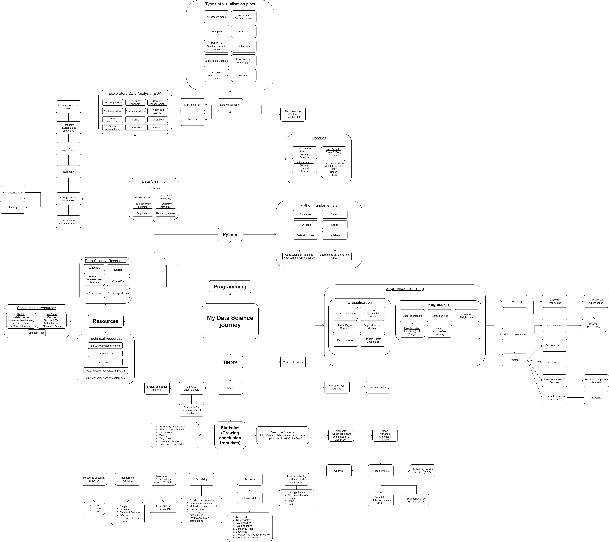
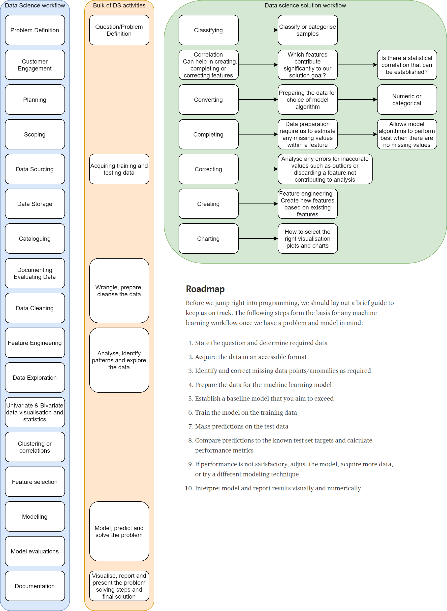

# DataScience Portfolio by Alistair Ho

This portfolio is a compilation of jupyter python notebooks which I created for data analysis or for exploration of machine learning algorithm which I used on my journey to learn Data Science.

I am passionate about data science as I love doing analysis on data, where the applications are vast and encapsulates nearly every industry to this day. Having an inquisitive mind and the satisfaction of solving problems are huge factors that motivate me to explore data science and I am excited to share my experiences here.

Having said that, I hope you do find this repository interesting!

# Repository layout

This repository is currently organised by:

* Machine learning - Projects focused on machine learning
* Practices - Projects focused on practicing with libraries relevant to data science
* Projects - Projects that explore all aspects of data science, from webscraping and data analysis to machine learning

# Resources

Most of my resources come from multiple sources:
* Medium - Towards Data Science
* YouTube - Tech with Tim, Ken Jee, Sentdex, Data Science Mojo, 3Blue1Brown, StatQuest with Josh Starmer
* CourseEra - Machine learning course with Andrew Ng
* eDx courses - Machine learning and python introduction
* Kaggle
* StackOverflow
* Reddit - /r/machinelearning, /r/datascience
* GitHub repositories

I also try my best to cite sources in my notebooks in markdown, of where I have taken my inspiration from.

# My Data Science Journey Mindmap

# Data Science Workflow Chart

